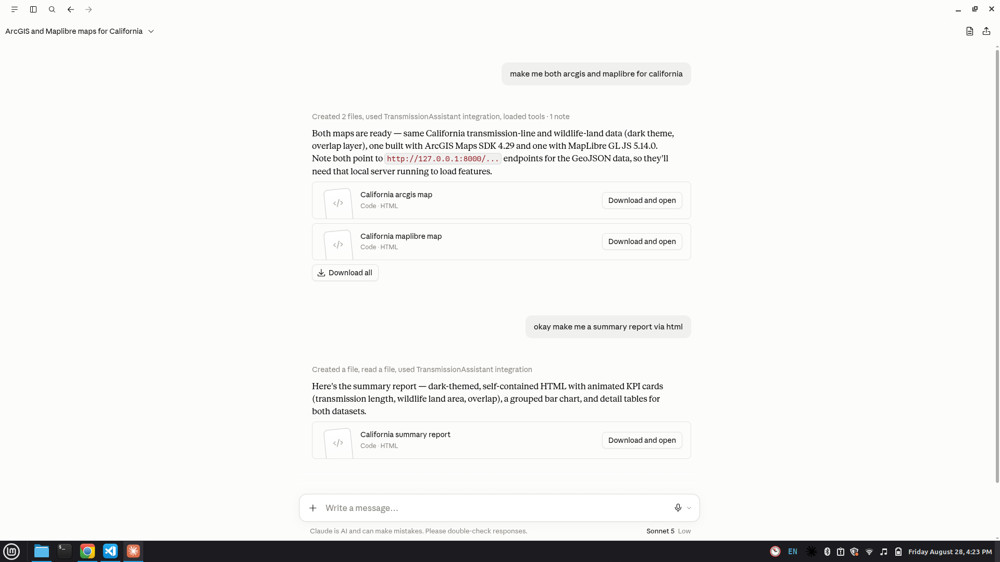
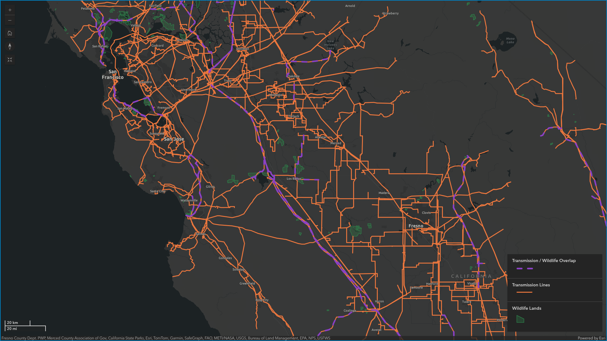
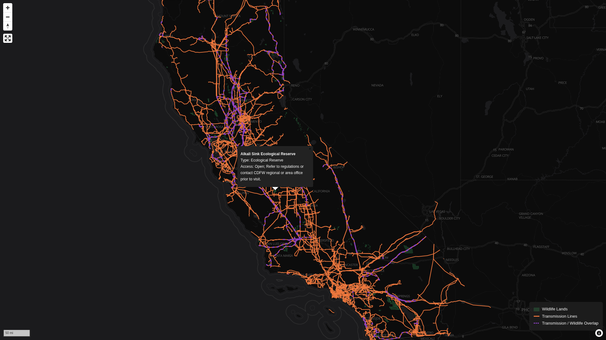
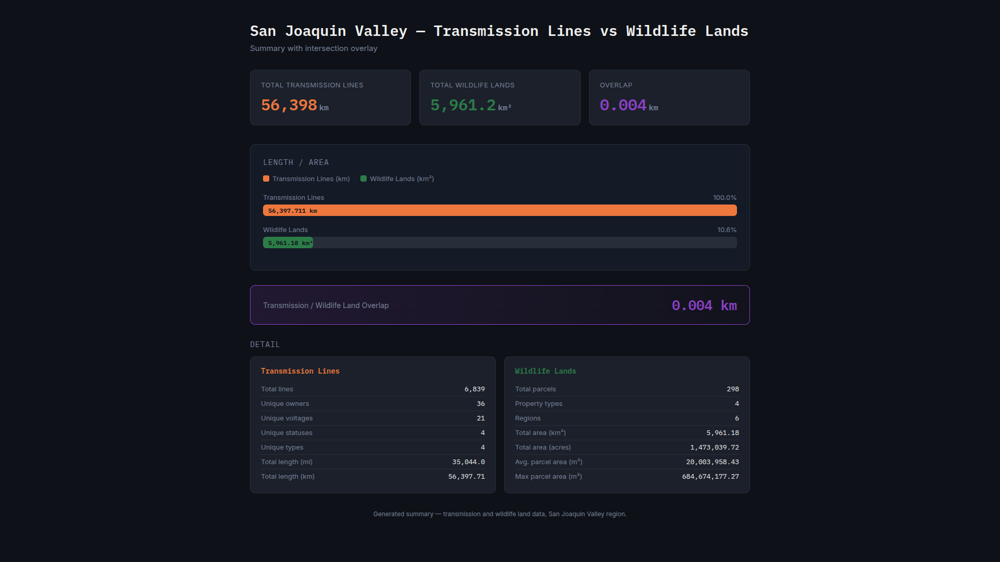

# AI-Assisted Transmission Line and Wildlife Analysis with MCP

## Use Case

A wildlife conservation group wants to monitor the potential impact of electrical transmission infrastructure on wildlife and protected lands in California's San Joaquin Valley.

The group has limited funding and cannot continuously perform manual GIS analysis or inspect large spatial datasets using traditional GIS software. They need a simple way to ask spatial questions about transmission lines and wildlife areas and receive analytical results without manually writing SQL or performing GIS operations.

This project uses the Model Context Protocol (MCP) to connect Claude to spatial data stored in GIS files and queried through DuckDB.

Instead of manually opening GIS software and performing spatial analysis, users can ask Claude questions using natural language.

## Screen Shots






Examples:

```text
Which wildlife areas intersect transmission lines?

Which transmission lines pass through public access lands?

How many transmission line segments intersect wildlife areas?

What wildlife areas are within 1 kilometer of a transmission line?

Show me the transmission lines that have potential impacts on wildlife areas.
```

Claude interprets the request, uses the MCP server to access the spatial data, performs the required DuckDB spatial queries, and returns the results in a readable format.

## Objective

The primary objective is to demonstrate how AI, MCP, DuckDB, and spatial data can be combined to create a lightweight GIS analysis assistant.

The project focuses on:

1. Natural-language access to spatial datasets
2. Spatial querying without requiring users to write SQL
3. Transmission line and wildlife-area analysis
4. Low-cost GIS data processing
5. Reproducible spatial analysis through DuckDB
6. Returning analytical results directly through Claude

## Data

The project currently works with two spatial datasets:

### Transmission Lines

Transmission line infrastructure represented as a Shapefile.

```text
data/
└── transmission_lines/
    └── TransmissionLine_CEC.shp
```

### Wildlife / Public Access Lands

California Department of Fish and Wildlife public access land data represented as a Shapefile.

```text
data/
└── public_lands/
    └── CDFW_Public_Access_Lands_[ds3077].shp
```

These datasets are loaded into DuckDB using the DuckDB Spatial extension.

## Architecture

The basic architecture is:

```text
User
  |
  | Natural-language question
  v
Claude
  |
  | MCP
  v
MCP Server
  |
  | DuckDB Spatial SQL
  v
Spatial Datasets
  |
  +-- Transmission Lines
  |
  +-- Wildlife / Public Access Lands
  |
  v
Analysis Result
  |
  v
Claude Response
```

The MCP server acts as the bridge between Claude and the spatial database layer.

DuckDB performs the actual data processing and spatial operations.

## Tech Stack

1. Python 3.14
2. DuckDB
3. DuckDB Spatial
4. MCP Python
5. PyArrow
6. Pandas
7. Claude

## Project Structure

```text
free-transmission-wildlife/
│
├── app/
│   ├── db/
│   │   ├── load_data.py
│   │   └── queries.py
│   │
│   └── server/
│       └── server.py
│
├── data/
│   ├── transmission_lines/
│   │   └── TransmissionLine_CEC.shp
│   │
│   └── public_lands/
│       └── CDFW_Public_Access_Lands_[ds3077].shp
│
├── pyproject.toml
├── uv.lock
├── Makefile
└── README.md
```

## Getting Started

This project uses `uv` for Python environment and dependency management.

Install the project dependencies:

```bash
uv sync
```

### Development

Start the MCP server in development mode:

```bash
make dev
```

This runs:

```bash
uv run mcp dev app/server/server.py
```

The development server can be used to test the MCP tools and inspect their behavior.

### Claude Installation

Install the MCP server for Claude:

```bash
make install
```

This runs the equivalent of:

```bash
uv run mcp install app/server/server.py
```

Once installed, the MCP server becomes available to Claude.

## Running the Application

After installing the MCP server, open Claude and start asking questions about the spatial datasets.

For example:

```text
Show me the schema of the transmission lines dataset.
```

```text
Show me the schema of the wildlife lands dataset.
```

```text
Find transmission lines that intersect wildlife lands.
```

```text
How many wildlife areas intersect transmission lines?
```

```text
Which transmission lines have the greatest number of wildlife intersections?
```

The MCP server translates these requests into operations against DuckDB.

## Spatial Analysis

The project is intended to support spatial operations such as:

* Intersection
* Within
* Distance analysis
* Buffer analysis
* Geometry inspection
* Spatial filtering
* Aggregation
* Counting intersecting features
* Area calculations
* Length calculations

For example, an intersection analysis can conceptually be represented as:

```sql
SELECT
    t.*,
    w.*
FROM transmission_lines t
JOIN wildlife_lands w
    ON ST_Intersects(t.geom, w.geom);
```

This allows DuckDB to perform the spatial analysis while Claude provides the natural-language interface.

## Output

Results are returned through Claude in Markdown.

Example:

```text
Transmission lines intersecting wildlife lands

| Transmission Line | Wildlife Area | Intersection |
|-------------------|---------------|--------------|
| Line A             | Area 001      | Yes          |
| Line B             | Area 014      | Yes          |
| Line C             | Area 021      | Yes          |

Total intersecting transmission lines: 3
```

The goal is to make the analytical result understandable to users without requiring them to understand SQL or DuckDB.

## Why DuckDB

DuckDB provides a lightweight analytical database that can query data directly without requiring a traditional database server.

Combined with the Spatial extension, it can perform GIS operations while maintaining a relatively simple architecture.

The project therefore does not require PostgreSQL/PostGIS for this prototype.

The architecture is:

```text
Shapefile / GeoParquet
        |
        v
      DuckDB
        |
        v
  DuckDB Spatial
        |
        v
    MCP Server
        |
        v
      Claude
```

This makes the project suitable for experimentation with AI-assisted GIS analysis.

## Future Development

Potential future improvements include:

1. Migrating from Shapefiles to GeoParquet
2. Adding more California wildlife datasets
3. Adding parcel datasets
4. Adding protected areas
5. Adding environmental constraint datasets
6. Adding distance and buffer analysis
7. Adding automated spatial reports
8. Adding map visualization
9. Returning GeoJSON results for web maps
10. Deploying the spatial data to cloud object storage
11. Adding larger-scale spatial datasets
12. Building an AI-assisted GIS analysis workflow

## Project Goal

The long-term goal is to demonstrate that spatial analysis can be made more accessible by combining traditional GIS data processing with natural-language AI interfaces.

Instead of requiring every user to know GIS software, SQL, and spatial database operations, the user can describe the question in natural language and let Claude coordinate the analysis through MCP and DuckDB.
